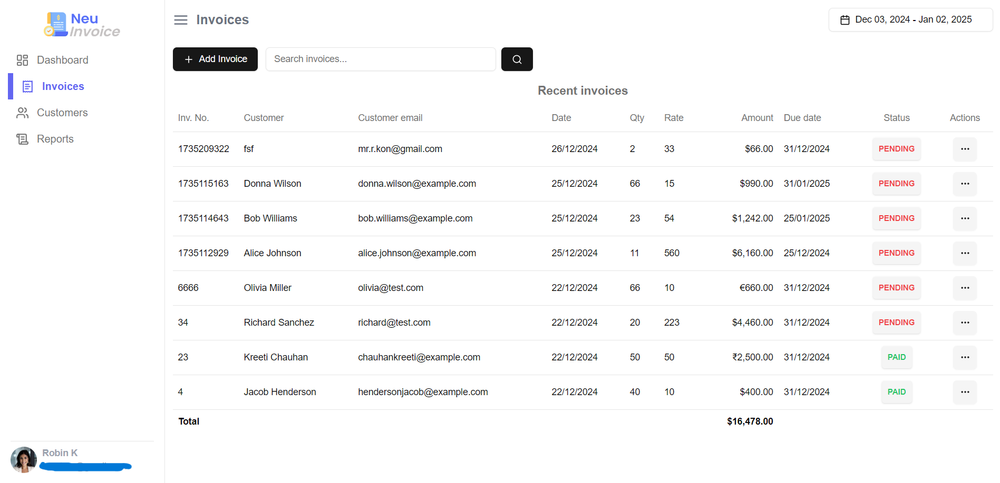

This application streamlines invoice creation for clients and facilitates easy sending via email in PDF format. It is developed using Next.js for frontend functionality, Auth.js for authentication management, Prisma is ORM (Object-Relational Mapping) for database operations, Neon for PostgreSQL database , Mailtrap for email testing, and Nodemailer for sending emails.

