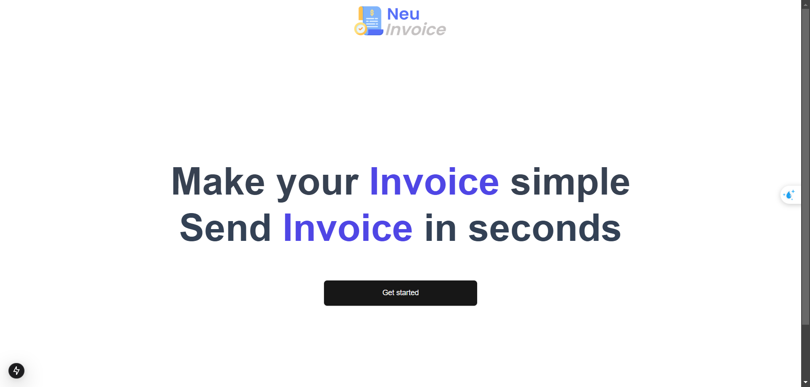
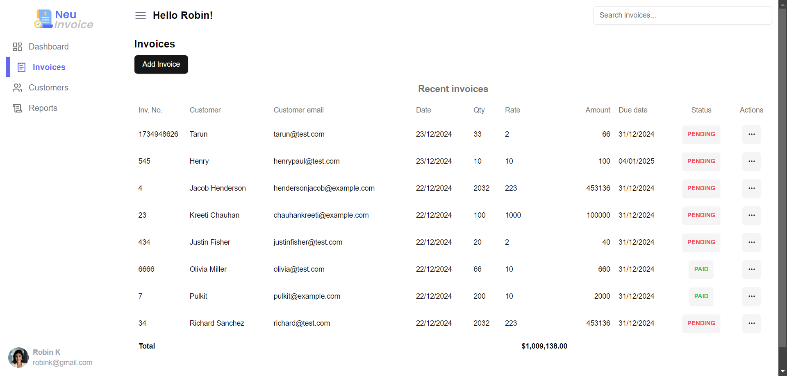

# Neu Invoice

This application streamlines invoice creation for clients and facilitates easy sending via email in PDF format. It is developed using Next.js for frontend functionality, Auth.js for authentication management, Prisma for database operations, Neon for ORM (Object-Relational Mapping), Mailtrap for email testing, and Nodemailer for sending emails.

